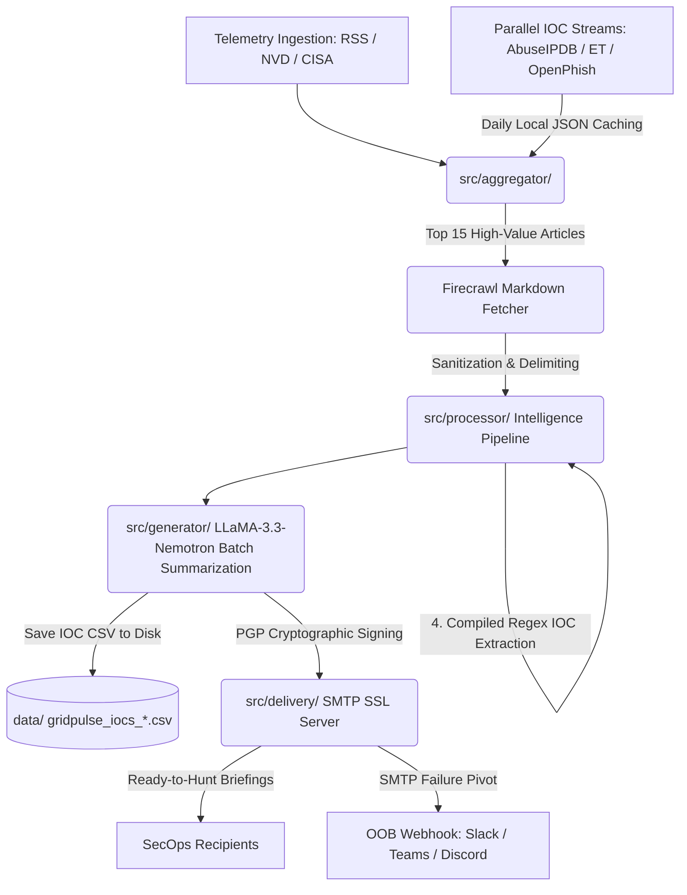

# GridPulse: Out-of-Band (OOB) Threat Intelligence & SecOps Dissemination Engine

   

GridPulse is a self-hosted, out-of-band (OOB) threat intelligence aggregation and SecOps dissemination engine designed to solve the "noise" problem in cybersecurity intelligence. It automatically harvests data from community feeds, OSINT feeds, and vendor advisories, filters them through a high-fidelity heuristic and AI-powered multi-stage enrichment pipeline, and delivers curated daily, weekly, or monthly briefings with actionable, structured threat-hunting CSV attachments.

---

## Key Features

- **Multi-Source Aggregation:** Universal parsing across RSS feeds, NVD 2.0 API, CISA Known Exploited Vulnerabilities (KEV), and custom vendor layout scrapers.
- **Parallel Intelligence Streams:** Evaluates incoming telemetry against three independent threat intelligence feeds—AbuseIPDB (verified malicious IPs), Emerging Threats (compromised infrastructure and malware domains), and OpenPhish (active phishing URLs)—with daily local caching to protect API limits.
- **Firecrawl Content Enrichment:** Features full-text markdown scraping of top-ranked security briefs to bypass superficial RSS snippets and maximize deep context extraction.
- **Advanced Processing Pipeline:** Employs a robust, two-tier "Heuristic-First, AI-Second" enforcement sequence across deduplication, categorization, and threat scoring.
- **NumPy-Optimized Semantic Deduplication:** Uses local NVIDIA text embedding models to detect and purge near-duplicate entries via vectorized matrix calculations, isolating up to 500 daily candidate records.
- **Neural Passage Reranking:** Merges conventional severity metrics (CVSS, KEV status) with neural ranking evaluations to blend heuristic weights with context relevance on a custom 60/40 scoring split.
- **Adversarial Ingestion Shield:** Implements a strict sanitization layer (`src/utils/sanitizer.py`) that isolates untrusted data in delimited blocks and enforces system-level execution constraints to prevent prompt injection.
- **Cryptographic Payload Integrity:** Natively integrates PGP/GPG signing for every HTML report, providing mathematical proof of origin and protection against transit tampering.
- **OOB Failover Resiliency:** Features an automated pivot mechanism; if primary SMTP SSL dispatch fails or times out, the engine immediately pushes high-severity alerts to secure Webhooks (Slack/Teams/Discord).
- **Local IOC Storage:** Automatically writes generated threat intelligence CSV reports to the local `data/` directory rather than attaching them to emails. This completely sidesteps SMTP gateway security scanners (e.g. Gmail `552 5.7.0`) that block transit of raw threat signature lists.
- **Gzip Attachment Fallback:** Integrates on-the-fly `gzip` compression helper fallback for email attachments to prevent raw text scanning filters and minimize network transfer sizes.
- **Startup Scheduler Guard:** Uses a database-backed 18-hour guard check during container start/restart sequences, checking if a briefing was already dispatched recently to prevent duplicate newsletter delivery.

---

## Architecture

```text
GridPulse/
├── src/
│   ├── aggregator/         # Ingestion Layer (RSS, NVD, CISA, OSINT Feeds, Firecrawl)
│   ├── config/             # High-Availability API & Source Config Synchronization
│   ├── database/           # SQLite Core Management (WAL-Mode Gateway)
│   ├── processor/          # Multi-Stage Filtering, Deduplication, and Reranking Engine
│   ├── generator/          # LLaMA Batch Summarization & Jinja2 Template Compositions
│   ├── delivery/           # SMTP SSL Dispatch Services & Webhook OOB Failover
│   ├── utils/              # Sanitization, CSV Serialization and UTC-Strict Timestamps
│   └── main.py             # Global Engine Orchestrator
├── database/               # Relational Schema Tracking & Initialization Blueprints
├── data/                   # Persistent DB Storage & Daily Local JSON Feed Caching
├── logs/                   # Rotating Operational Log Archives
└── templates/              # Jinja2 Production Email Envelopes (HTML & Plain-Text)
```

### Pipeline Dataflow



### Architecture Philosophy: Framework-Agnostic Processing

To meet tight enterprise security and efficiency footprints, GridPulse completely rejects bloated wrapper frameworks (e.g., LangChain, LlamaIndex) in favor of explicit, deterministic operations.

#### Why Custom & Native?

- **NumPy over Dedicated Vector Databases:** Standard Vector DBs (ChromaDB, Milvus, pgvector) require significant memory overhead and independent system maintenance. Because GridPulse filters highly dense daily pools capped at 500 concurrent candidate articles, performing vector dot-product similarity directly in NumPy matrix arrays delivers microsecond execution times using standard computing hardware.
- **Minimal Dependency Attack Surface:** Interfacing directly with the openai Python client by modifying the endpoint route prevents the framework deprecation loops and black-box runtime behavior typical of enterprise orchestration layers.
- **Database Independence with WAL Mode:** Transitioning the engine onto SQLite 3 running Write-Ahead Logging (WAL) ensures continuous ingestion routines. Aggregation fetchers can seamlessly write intel while generation schedulers simultaneously query existing baselines without locking.

---

## Getting Started

### Prerequisites

- Docker and Docker Compose (v2+)
- NVIDIA Build API Account (One key unlocks all pipeline models)
- SMTP SSL Dispatch Access (Port 465 enforced)
- GPG Keypair (Optional, for payload signing)
- (Optional) AbuseIPDB, Firecrawl, and OOB Webhook URLs

### Installation

1. **Clone the Infrastructure Repo:**
   ```bash
   git clone https://github.com/your-username/GridPulse
   cd GridPulse
   ```

2. **Establish Environment Parameters:**
   ```bash
   cp .env.example .env
   ```

3. **Configure .env:**
   ```env
   # Core AI Model Ingestion
   NVIDIA_SUMMARIZER_KEY=nvapi-your-key
   NVIDIA_EMBEDDING_KEY=nvapi-your-key
   NVIDIA_CATEGORIZER_KEY=nvapi-your-key
   NVIDIA_RERANKER_KEY=nvapi-your-key

   # SMTP SSL Outbound Delivery (Port 465 Mandatory)
   SMTP_HOST=smtp.yourserver.com
   SMTP_PORT=465
   SMTP_USER=dispatch@yourdomain.com
   SMTP_PASS=your-secure-password
   EMAIL_TO=soc-alerts@yourdomain.com

   # OOB Fallback & Security
   OOB_WEBHOOK_URL=https://hooks.slack.com/services/...
   GPG_KEY_ID=your-key-id
   GPG_PASSPHRASE=your-passphrase
   ```

4. **Deploy:**
   ```bash
   docker compose up -d --build
   ```
   *Note: Upon successful deployment, GridPulse immediately executes a "Run on Startup" baseline telemetry report. You should receive your first briefing within minutes.*

---

## Tech Stack

- **Runtime Environment:** Python 3.12
- **Data Analytics:** NumPy, PyYAML
- **Database Architecture:** SQLite 3 (WAL Mode Enabled)
- **AI/LLM Architecture (NVIDIA NIM):**
  - **Summarization:** `nvidia/llama-3.3-nemotron-super-49b-v1`
  - **Embeddings:** `nvidia/llama-nemotron-embed-1b-v2`
  - **Categorization:** `meta/llama-3.1-8b-instruct`
  - **Reranking:** `nvidia/llama-nemotron-rerank-1b-v2`
- **Security:** GnuPG, SSL/TLS 1.3

---

## Security, Resiliency & Defenses

### High-Availability API Key Rotation
GridPulse tracks all supplied keys inside a distribution pool (`NVIDIA_KEYS`). If an inference task triggers an HTTP 429 Rate Limit, the engine isolates the exception, pivots to the next available key, and transparently attempts to re-execute the batch.

### Adversarial Ingestion Shield (Prompt Injection)
To mitigate LLM-based "jailbreak" or command injection attempts from malicious feed content, GridPulse implements a robust sanitization layer (`src/utils/sanitizer.py`). It enforces strict character-length boundaries and wraps all untrusted telemetry in isolated `[RAW_DATA]` blocks, combined with system-level execution constraints that forbid the model from following instructions contained within the ingested data.

### JSON Recovery Parsers
Because the ultra-fast `meta/llama-3.1-8b-instruct` model can occasionally output trailing text under load, classifications are evaluated using a custom `_safe_parse_json()` sequence. This utilizes `raw_decode` to halt immediately at the primary array boundary, dropping malformed trailing strings.

---

## Troubleshooting

### Persistence & Permissions
If you encounter `sqlite3.OperationalError: unable to open database file`, it is likely due to a host-to-container permission mismatch. 

- **Automatic Fix**: Ensure you use the provided `setup.sh` script, which handles dynamic UID/GID mapping.
- **Manual Fix**: If you ran `docker compose up` as root, you may need to reclaim ownership of the data directories:
  ```bash
  sudo chown -R $USER:$USER data logs
  docker compose up -d --build
  ```

---

## License

Distributed under the MIT License. See LICENSE for further parameters.
